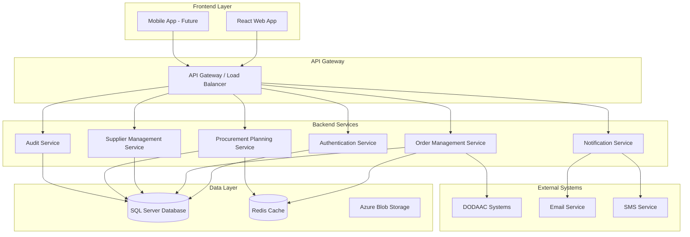

# Procurement Planner Design Document

## Overview

The Procurement Planner is designed as a modern, scalable enterprise application using a microservices-oriented architecture with .NET 9.0 backend and React frontend. The system emphasizes security, auditability, and real-time data processing to handle complex procurement workflows efficiently.

## Architecture

### High-Level Architecture



### Technology Stack

**Backend:**
- .NET 9.0 with ASP.NET Core Web API
- Entity Framework Core for ORM
- SQL Server for primary database
- Redis for caching and session management
- SignalR for real-time notifications
- JWT for authentication
- AutoMapper for object mapping
- FluentValidation for input validation

**Frontend:**
- React 18 with TypeScript
- Material-UI or Ant Design for enterprise UI components
- Redux Toolkit for state management
- React Query for server state management
- React Router for navigation
- Formik for form handling

**Infrastructure:**
- Docker containers for deployment
- Azure/AWS for cloud hosting
- Application Insights for monitoring
- Azure Service Bus for message queuing

## Components and Interfaces

### Core Domain Models

#### User Management
```csharp
public class User
{
    public Guid Id { get; set; }
    public string Username { get; set; }
    public string Email { get; set; }
    public UserRole Role { get; set; }
    public bool IsActive { get; set; }
    public DateTime CreatedAt { get; set; }
    public DateTime LastLoginAt { get; set; }
}

public enum UserRole
{
    Administrator,
    LMRPlanner,
    Supplier,
    Customer
}
```

#### Order Management
```csharp
public class CustomerOrder
{
    public Guid Id { get; set; }
    public string OrderNumber { get; set; }
    public string CustomerId { get; set; } // DODAAC
    public string CustomerName { get; set; }
    public ProductType ProductType { get; set; }
    public DateTime RequestedDeliveryDate { get; set; }
    public OrderStatus Status { get; set; }
    public List<OrderItem> Items { get; set; }
    public DateTime CreatedAt { get; set; }
    public string CreatedBy { get; set; }
}

public class OrderItem
{
    public Guid Id { get; set; }
    public Guid OrderId { get; set; }
    public string ProductCode { get; set; }
    public string Description { get; set; }
    public int Quantity { get; set; }
    public string Unit { get; set; }
    public string Specifications { get; set; }
}

public enum ProductType
{
    LMR,
    FFV
}

public enum OrderStatus
{
    Submitted,
    UnderReview,
    PlanningInProgress,
    PurchaseOrdersCreated,
    AwaitingSupplierConfirmation,
    InProduction,
    ReadyForDelivery,
    Delivered,
    Cancelled
}
```

#### Purchase Order Management
```csharp
public class PurchaseOrder
{
    public Guid Id { get; set; }
    public string PurchaseOrderNumber { get; set; }
    public Guid CustomerOrderId { get; set; }
    public Guid SupplierId { get; set; }
    public PurchaseOrderStatus Status { get; set; }
    public DateTime RequiredDeliveryDate { get; set; }
    public List<PurchaseOrderItem> Items { get; set; }
    public DateTime CreatedAt { get; set; }
    public Guid CreatedBy { get; set; }
    public DateTime? ConfirmedAt { get; set; }
    public string SupplierNotes { get; set; }
}

public class PurchaseOrderItem
{
    public Guid Id { get; set; }
    public Guid PurchaseOrderId { get; set; }
    public Guid OrderItemId { get; set; }
    public int AllocatedQuantity { get; set; }
    public string PackagingDetails { get; set; }
    public string DeliveryMethod { get; set; }
    public DateTime? EstimatedDeliveryDate { get; set; }
}

public enum PurchaseOrderStatus
{
    Created,
    SentToSupplier,
    Confirmed,
    Rejected,
    InProduction,
    ReadyForShipment,
    Shipped,
    Delivered
}
```

#### Supplier Management
```csharp
public class Supplier
{
    public Guid Id { get; set; }
    public string Name { get; set; }
    public string ContactEmail { get; set; }
    public string ContactPhone { get; set; }
    public string Address { get; set; }
    public bool IsActive { get; set; }
    public List<SupplierCapability> Capabilities { get; set; }
    public SupplierPerformanceMetrics Performance { get; set; }
}

public class SupplierCapability
{
    public Guid Id { get; set; }
    public Guid SupplierId { get; set; }
    public ProductType ProductType { get; set; }
    public int MaxMonthlyCapacity { get; set; }
    public int CurrentCommitments { get; set; }
    public decimal QualityRating { get; set; }
}

public class SupplierPerformanceMetrics
{
    public Guid SupplierId { get; set; }
    public decimal OnTimeDeliveryRate { get; set; }
    public decimal QualityScore { get; set; }
    public int TotalOrdersCompleted { get; set; }
    public DateTime LastUpdated { get; set; }
}
```

### Service Interfaces

#### Order Management Service
```csharp
public interface IOrderManagementService
{
    Task<CustomerOrder> CreateOrderAsync(CreateOrderRequest request);
    Task<PagedResult<CustomerOrder>> GetOrdersAsync(OrderFilterRequest filter);
    Task<CustomerOrder> GetOrderByIdAsync(Guid orderId);
    Task<CustomerOrder> UpdateOrderStatusAsync(Guid orderId, OrderStatus status);
    Task<List<CustomerOrder>> GetOrdersByDeliveryDateAsync(DateTime startDate, DateTime endDate);
}
```

#### Procurement Planning Service
```csharp
public interface IProcurementPlanningService
{
    Task<List<PurchaseOrder>> CreatePurchaseOrdersAsync(Guid customerOrderId, DistributionPlan plan);
    Task<DistributionSuggestion> SuggestSupplierDistributionAsync(Guid customerOrderId);
    Task<PurchaseOrder> ConfirmPurchaseOrderAsync(Guid purchaseOrderId, SupplierConfirmation confirmation);
    Task<List<PurchaseOrder>> GetPurchaseOrdersBySupplierAsync(Guid supplierId);
}
```

#### Supplier Management Service
```csharp
public interface ISupplierManagementService
{
    Task<List<Supplier>> GetAvailableSuppliersAsync(ProductType productType, int requiredCapacity);
    Task<Supplier> UpdateSupplierCapacityAsync(Guid supplierId, UpdateCapacityRequest request);
    Task<SupplierPerformanceMetrics> GetSupplierPerformanceAsync(Guid supplierId);
    Task UpdateSupplierPerformanceAsync(Guid supplierId, PerformanceUpdate update);
}
```

### API Endpoints

#### Order Management Controller
```
GET    /api/orders                    - Get orders with filtering
POST   /api/orders                    - Create new order
GET    /api/orders/{id}               - Get order by ID
PUT    /api/orders/{id}/status        - Update order status
GET    /api/orders/dashboard          - Get dashboard summary
```

#### Procurement Planning Controller
```
POST   /api/procurement/distribute    - Create purchase orders from customer order
GET    /api/procurement/suggestions   - Get supplier distribution suggestions
PUT    /api/procurement/{id}/confirm  - Confirm purchase order
GET    /api/procurement/supplier/{id} - Get purchase orders for supplier
```

#### Supplier Management Controller
```
GET    /api/suppliers                 - Get suppliers with filtering
GET    /api/suppliers/{id}/performance - Get supplier performance metrics
PUT    /api/suppliers/{id}/capacity   - Update supplier capacity
```

## Data Models

### Database Schema Design

The system uses a normalized relational database design with the following key tables:

- **Users**: User accounts and authentication
- **CustomerOrders**: Main order records
- **OrderItems**: Line items for each order
- **Suppliers**: Supplier master data
- **SupplierCapabilities**: Supplier capacity and product type mappings
- **PurchaseOrders**: Purchase orders sent to suppliers
- **PurchaseOrderItems**: Line items for purchase orders
- **AuditLogs**: Complete audit trail of all system actions
- **Notifications**: System notifications and alerts

### Caching Strategy

Redis caching is implemented for:
- User session data
- Frequently accessed supplier performance metrics
- Dashboard summary data
- Real-time order status updates

## Error Handling

### Exception Handling Strategy

1. **Global Exception Handler**: Centralized exception handling middleware
2. **Custom Exceptions**: Domain-specific exceptions for business rule violations
3. **Validation Errors**: Structured validation error responses
4. **Logging**: Comprehensive logging with correlation IDs for request tracking

### Error Response Format
```json
{
  "success": false,
  "error": {
    "code": "VALIDATION_ERROR",
    "message": "One or more validation errors occurred",
    "details": [
      {
        "field": "deliveryDate",
        "message": "Delivery date cannot be in the past"
      }
    ]
  },
  "correlationId": "abc123-def456"
}
```

## Testing Strategy

### Unit Testing
- Service layer unit tests with mocked dependencies
- Repository pattern testing with in-memory database
- Domain model validation testing
- Target: 90% code coverage

### Integration Testing
- API endpoint testing with test database
- Database integration tests
- External service integration tests
- Authentication and authorization testing

### End-to-End Testing
- Critical user journey automation
- Cross-browser compatibility testing
- Performance testing under load
- Security penetration testing

### Test Data Management
- Automated test data seeding
- Test database isolation
- Data cleanup after test runs
- Realistic test scenarios based on production data patterns

## Security Considerations

### Authentication & Authorization
- JWT-based authentication with refresh tokens
- Role-based access control (RBAC)
- Multi-factor authentication for sensitive operations
- Session timeout and automatic logout

### Data Protection
- Encryption at rest for sensitive data
- TLS 1.3 for data in transit
- Input validation and sanitization
- SQL injection prevention through parameterized queries

### Audit & Compliance
- Complete audit trail of all user actions
- Data retention policies
- GDPR compliance for personal data
- Regular security assessments and updates